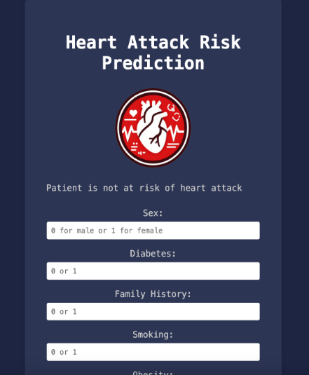

# Heart Attack Risk Prediction Web App

## Overview

This web application predicts the risk of a heart attack based on user-input parameters such as sleep hours per day, cholesterol levels, obesity, and diabetes. It utilizes a logistic regression model trained on a dataset of relevant health features.

## Features

- User-friendly interface for inputting health parameters
- Real-time prediction of heart attack risk
- Modern and visually appealing design

## Requirements

- Python 3.x
- Flask
- scikit-learn
- pandas
- joblib

## Installation

1. Clone the repository:
   git clone https://github.com/s02singh/HARclassification.git

2. pip install -r requirements.txt

3. python app.py

## Usage
  - Enter the required health parameters in the input form.
  - Click the "Predict" button.
  - View the predicted heart attack risk.

## Folder Structure
  - app.py: Main Flask application file.
  - static/: Contains static assets (CSS file, images).
  - templates/: HTML templates for rendering web pages.

## Credits
  - The predictive model is built using scikit-learn and pandas.
  - Design inspiration and guidance from the ChatGPT website.
 
## License
  - This project is licensed under the MIT License - see the LICENSE file for details.

